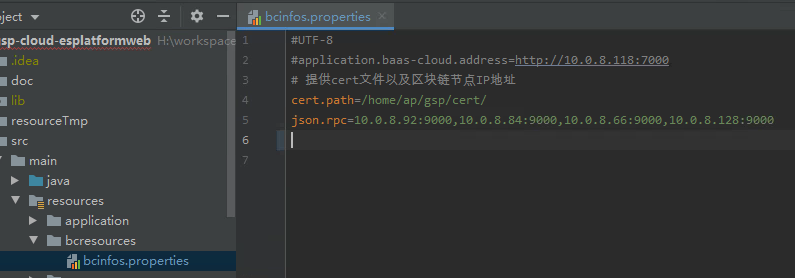
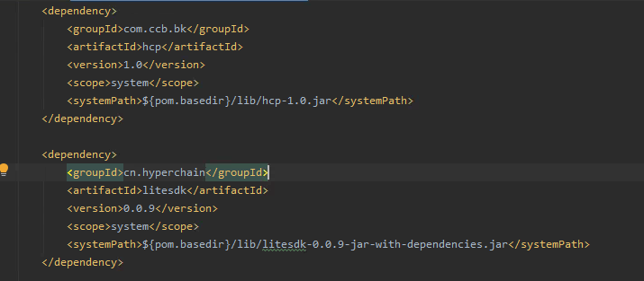
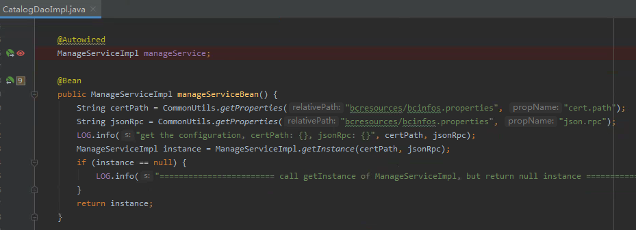
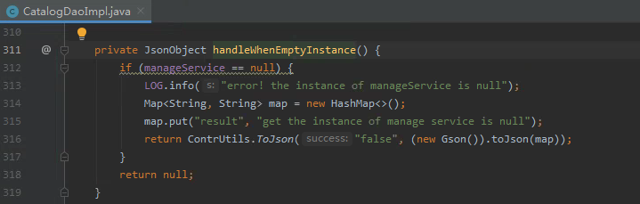
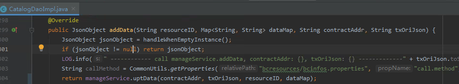
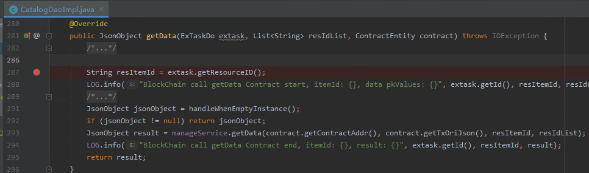

# 区块链API升级使用说明

因趣链平台Java SDK升级，近期要对区块链门户网站上已有的需要与区联平台对接的功能进行升级。本次已完成数据合约的上链与查询功能的改造，并在测试环境通过了对接的联调测试。

## 开发使用步骤

### 1. 环境准备

#### 1.1 Cert文件与区块链节点地址

区块链数据接入层接口调用趣链Javasdk访问合约，趣链javasdk直接和节点通信，因此需要由应用程序提供cert文件以及区块链节点IP地址。由趣链平台提供相应环境的Cert文件与区块链节点信息。

添加Cert文件与节点信息的配置：

#### 1.2 添加jar包

项目lib路径下

### 2. 代码开发

#### 2.1 ManageServiceImpl初始化

初始化ManageServiceImpl实例，必须传入正确的certpath和jsonrpc，如果路径不对或者证书认证不通过以及节点连接不上会返回null。

调用接口之前，做实例为空的判断

#### 2.2 业务接口使用

#### 2.2.1 数据上链

保存数据到链上，传入数据合约地址、资源归属方签名文件内容、资源标识、数据集合Map。

说明：
目录合约要先上链，数据合约才可以使用对应资源的resourceID进行上链；
参与方必须要有该资源的读写权限；
调用方需要注意区分权限合约地址和数据合约地址；
集合Map的key为数据记录的业务主键值，value为整条记录；
单次上链的数据量不要超过500条；

#### 2.2.2 数据查询

查询链上数据, 传入数据合约地址、资源归属方签名文件内容、资源标识、数据id列表。

