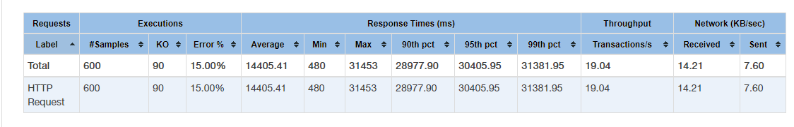
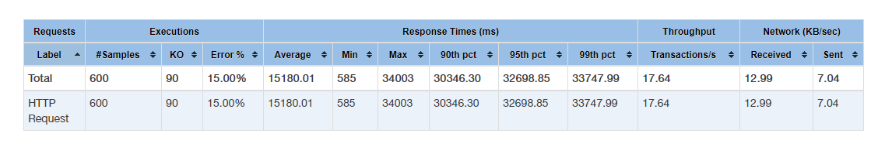
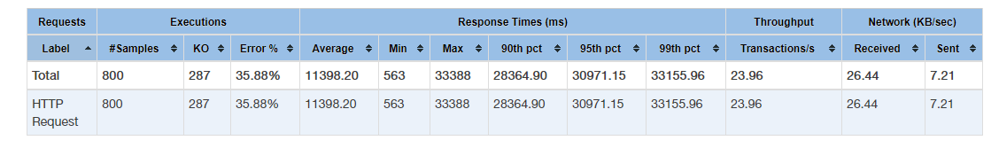
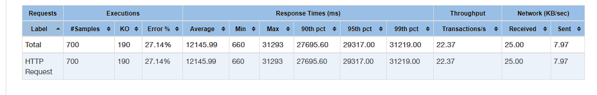
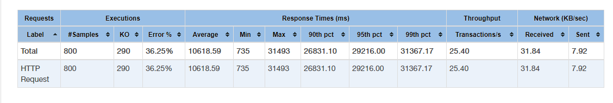

# 区块链API性能测试

因客户的实际需求，需要提供区块链平台数据上链与链上数据查询的性能指标。本次对测试环境的服务，使用JMeter工具进行并发压力测试，测试报告如下所示。

## 1. 数据上链性能测试

### 1.1 上链情况

每次单条数据上链，请求的并发量分别为500、600、700、800、900、1000，都进行三轮测试。

### 1.2 测试报告  

经过对各个并发量的三轮测试，并发量为500时，性能稳定，上升到900性能比较差。具体情况如下

#### 1.2.1 并发量500

#### 1.2.2 并发量600

#### 1.2.3 并发量700

#### 1.2.4 并发量800

#### 1.2.5 并发量900

## 2. 链上数据查询性能测试

### 2.1 查询情况

每次查询一条数据，请求的并发量分别为500、600、700、800、900、1000，都进行三轮测试。

### 2.2 测试报告

经过对各个并发量的三轮测试，并发量为500时，性能稳定，上升到900性能比较差。具体情况如下

#### 2.2.1 并发量500

#### 2.2.2 并发量600

#### 2.2.3 jmeter/并发量700

#### 2.2.4 并发量800

#### 2.2.5 并发量900

