# 题目

## 主题

### 索引

#### 远程sftp服务器

194全部目录如下
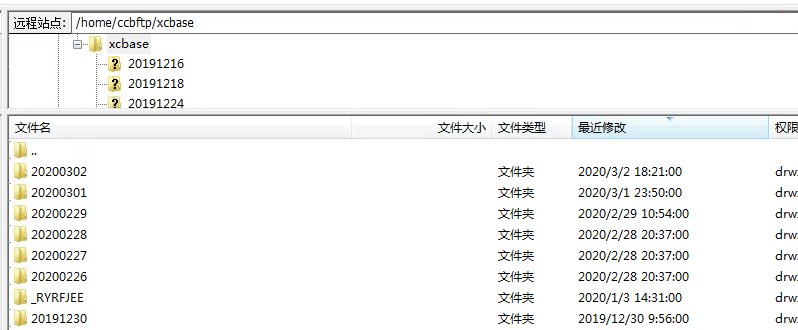
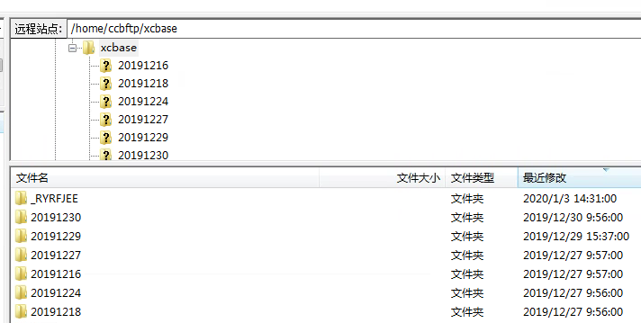
说明：
为了模拟案例三的特殊情况，目录下的20200302、20200301这两个目录在3月1日一起上传的，3月2日对20200302目录补充了两个文件。
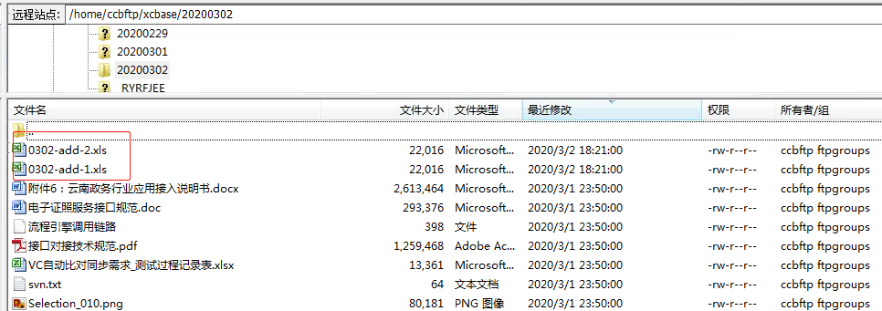

#### 案例一

场景：初次拉取，本地全量及增量目录都为空，
测试日期及maxNum:
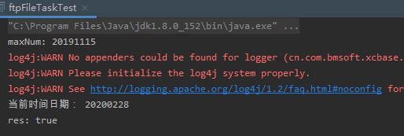

全量目录：
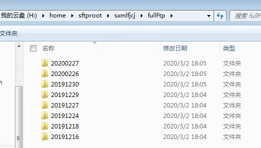

增量目录：

#### 案例二

场景：本地全量不变，增量目录都为空（删除了add0227目录），
测试日期及maxNum:
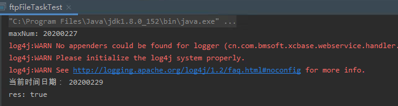

全量目录：
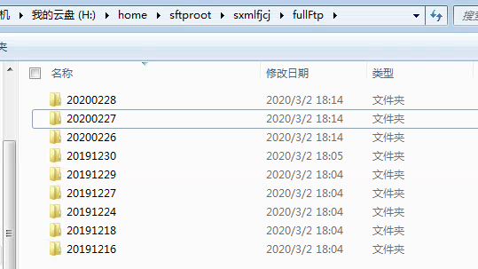

增量目录：
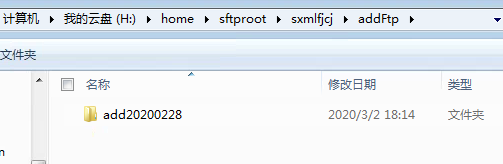

#### 案例三

场景：特殊情况，本地全量及增量目录不动，主要模拟线上实际拉取的异常情况--（以服务器时间为准）在26号，全量目录拉取了20200225和20200226目录，增量目录下最新目录是add20200226目录，其次级目录为20200225和20200226。在27号未拉取省上20200226目录（里面的文件后来有更新），即全量目录20200226文件数量比省上少很多，增量目录下也没有add20200226。

##### 测试A

测试日期及maxNum:
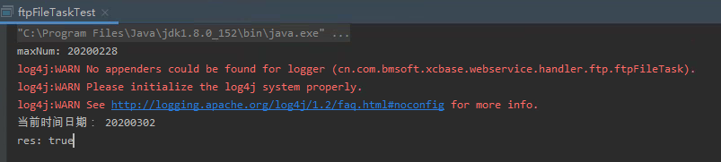

全量目录：
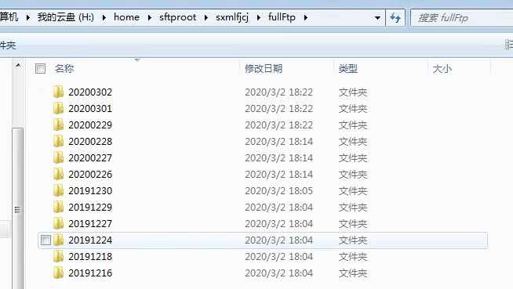

增量目录：
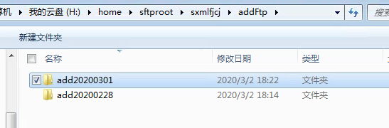
其add20200301、20200302的内容如下：
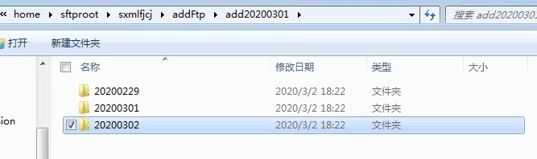

##### 测试B

测试日期及maxNum:
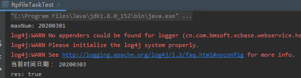

全量目录：
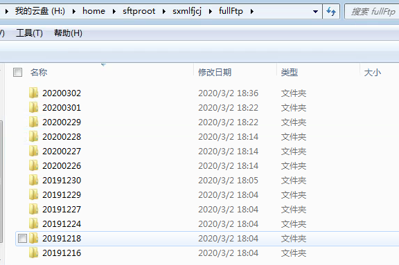
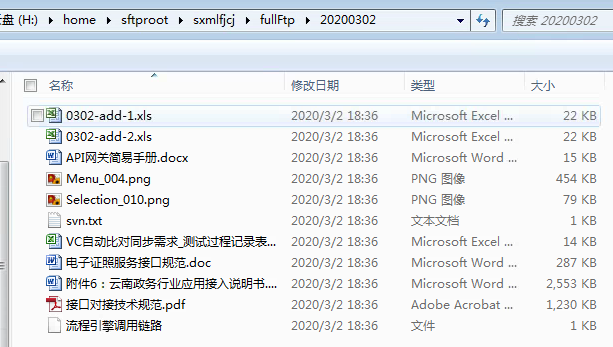

增量目录：
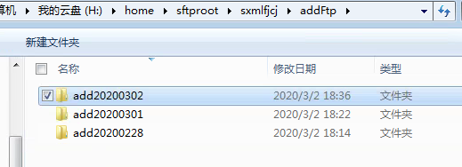
其20200302的内容如下：

全量目录和增量目录都会拉取下来的文件与sftp服务器上的目录文件一致，修改后的方案，确保了特殊情况下，文件能够正常拉取。

#### 解决方案

主要是文件拉取的时间窗口左边界取值，加入了对增量目录的判断。
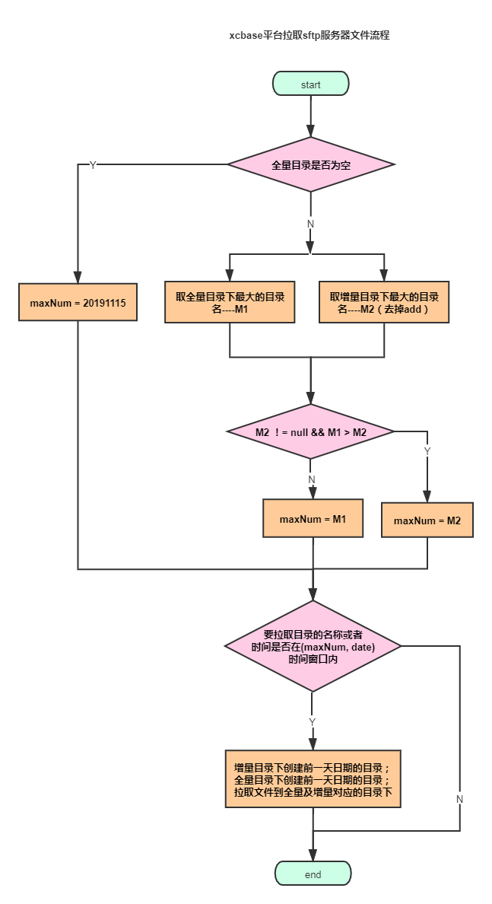
