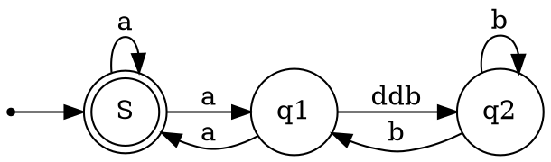
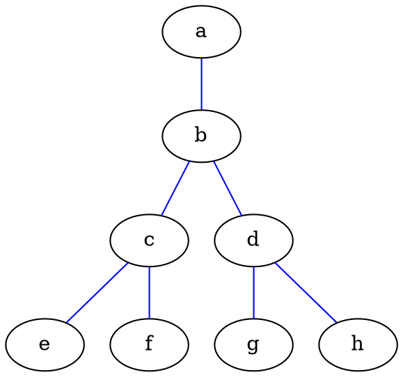
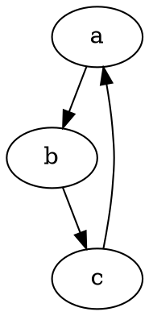
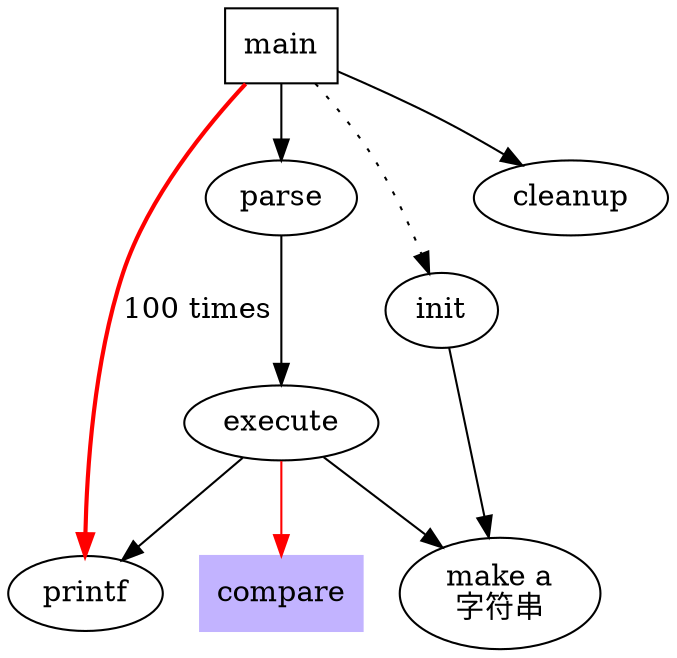
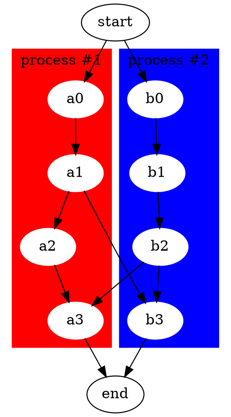
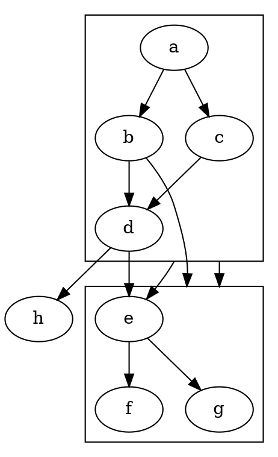
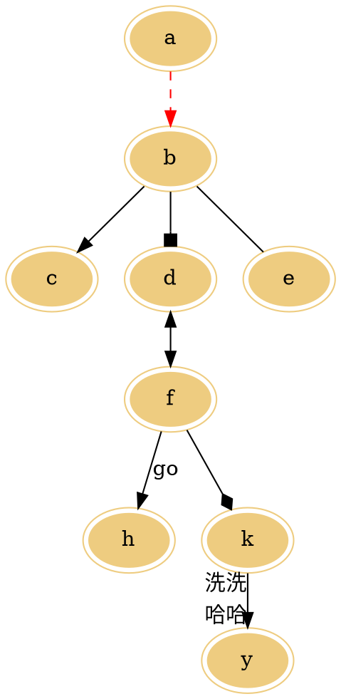

# 题目  

## 主题  

### table

| 时间 | 地点 | 计划 |
| --- | --- | --- |
| 20200212 | company | working |
| 20200213 | home | resting |

#### flow graph

```flow
st=>start: 页面加载
e=>end: End:>http://www.google.com
op1=>operation: get_hotel_ids|past
op2=>operation: get_proxy|current
sub1=>subroutine: get_proxy|current
op3=>operation: save_comment|current
op4=>operation: set_sentiment|current
op5=>operation: set_record|current
cond1=>condition: ids_remain空?
cond2=>condition: proxy_list空?
cond3=>condition: ids_got空?
cond4=>condition: 爬取成功??
cond5=>condition: ids_remain空?
io1=>inputoutput: ids-remain
io2=>inputoutput: proxy_list
io3=>inputoutput: ids-got
st->op1(right)->io1->cond1
cond1(yes)->sub1->io2->cond2
cond2(no)->op3
cond2(yes)->sub1
cond1(no)->op3->cond4
cond4(yes)->io3->cond3
cond4(no)->io1
cond3(no)->op4
cond3(yes, right)->cond5
cond5(yes)->op5
cond5(no)->cond3
op5->e
```

```flow
start=>start: start
condition1=>condition: 全量目录是否为空？
operation1=>operation: maxNum = 20191115
operation2=>operation: 取全量目录下最大
的日期目录----M1

condition2=>condition: 增量目录是否为空？
operation3=>operation: maxNum = M1
operation4=>operation: 取全量目录下最大
的日期目录----M2

condition3=>condition: M1 > M2?
operation5=>operation: maxNum = M2

condition4=>condition: 要拉取目录的名称或者
时间是否在(maxNum, date)
时间窗口内?
operation6=>operation: 增量目录下创建前一天日期的目录；
全量目录下创建前一天日期的目录；
拉取文件到全量及增量对应的目录下

end=>end: end

start->condition1
condition1(yes)->operation1->condition4
condition1(no,bottom)->operation2->condition2

condition2(yes)->operation3->condition4
condition2(no,bottom)->operation4->condition3

condition3(yes)->operation5->condition4
condition3(no)->operation3

condition4(yes)->operation6->end
condition4(no)->end
```

#### sequence graph

```sequence
bgbiao-> bianbian: good morning
note left of bgbiao: man
bianbian -> bgbiao: eat something
note right of bianbian: woman
  
note over bgbiao: test
```

#### mermaid graph

以mermaid形式嵌入，显示出现问题，节点呈黑色块，线条不显示。
使用mmd文件，其图形效果比graphviz更美观。

#### graphviz(dot)










##### 子图





##### 箭头标记



参考：
<https://www.jianshu.com/p/e44885a777f0>
